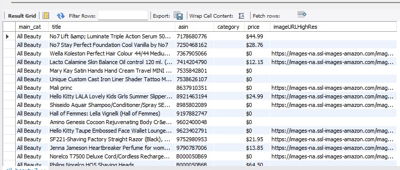
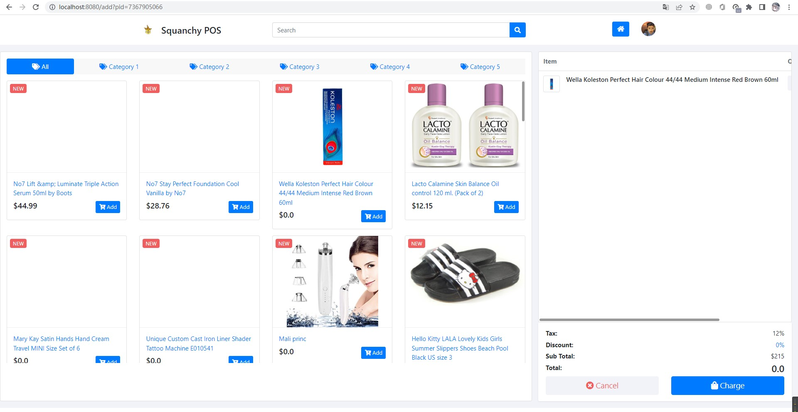

# aw06

### REPORT 报告

数据集选择

将数据集转换至`MySQL`数据库中：

重新更改`aw04`来从新的数据库中获取数据：

*请注意：源代码中的数据集路径并非仓库中提交的路径，且每个数据集在转换至数据库时均手动更改了代码中路径等相关参数，运行源代码前请：*

+ 手动初始化对应数据库
+ 更改代码中读取的`JSON`文件路径为实际存放地址
+ 处于设备负载考虑，每次仅会读取前50个商品，读取更多商品的按钮未完全实现（研究了几个小时，但仍没有弄清楚Thymeleaf应当如何实现）
+ 如需加载全部商品，请修改`aw04`中SQL语句，将LIMIT及其参数删除

### Original README.md

[Amazon Review Data (2018)](https://nijianmo.github.io/amazon/index.html) has a huge products metadata set of multiple categories.

|category| reviews | metadata |
|--| -- | -- |
|Amazon Fashion|reviews (883,636 reviews)|metadata (186,637 products)|
|All Beauty|reviews (371,345 reviews)|metadata (32,992 products)|
|Appliances|reviews (602,777 reviews)|metadata (30,459 products)|
| ... |
|Tools and Home Improvement|reviews (9,015,203 reviews)|metadata (571,982 products)|
Toys and Games|reviews (8,201,231 reviews)|metadata (634,414 products)|
Video Games|reviews (2,565,349 reviews)|metadata (84,893 products)|

Please finish the following tasks:

- Download no less than two categories of these metadata.
- Referring the example code in this repo, convert each line in the downloaded files into a POJO of `Product` class and save the object in a database like MySQL. 
- Integrate the database containing Amazon products with your own AW04 project and build an Amazon WebPOS system.

And, of course, always try to make the system run as fast as possible.